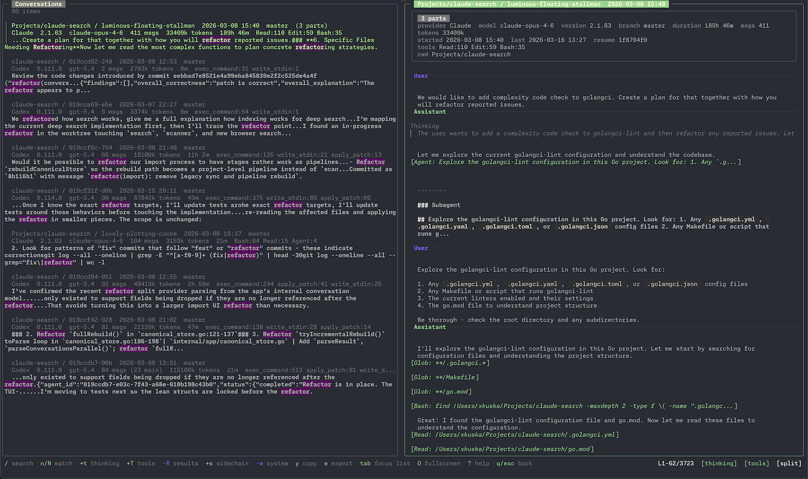

# carn

A terminal UI for browsing, searching, and managing your local Claude and
Codex session archives.

## What it does

You accumulate hundreds of AI coding sessions across different projects.
They live as raw JSONL files scattered under `~/.claude/projects/` and
`~/.codex/sessions/`. carn indexes them into a local SQLite store and
gives you a fast, searchable TUI to browse conversations, read
transcripts, and **r**esume sessions — without leaving the terminal.



## Features

**Browsing**

- Conversation list with model, token count, duration, tool usage, and
  git branch
- **f**ilter by provider, project, model, git branch, plan status, or
  multi-part conversations — with regex support
- Automatic grouping of related sessions into multi-part conversations
- Subagent detection and display
- Split and fullscreen layout modes with `tab` to switch focus

**Search**

- Search (`/`) — debounced full-text search across all message content
  via the SQLite FTS index; an empty query returns to the full
  conversation list
- Structured filters (`f`) handle provider, project, model, git branch,
  plan, and multi-part narrowing
- Search preview snippets in results

**Transcript viewer**

- Markdown rendering with syntax highlighting
- Toggleable sections: **t**hinking blocks, **T**ool calls, tool
  **R**esults, **s**idechain messages, syste**m** messages, **p**lans
- Diff display with colored additions and removals
- Search within transcript (`/`) with **n**ext / **N** previous match
  navigation

**Actions**

- **r**esume a session in the original provider with correct working
  directory — works for both Claude and Codex sessions
- Cop**y** to clipboard — pick a target: **c**onversation, **p**lan,
  or **r**aw source files
- **e**xport conversation as Markdown
- **o**pen conversation, plan, or raw files in `$EDITOR`
- **R**esync from source directories without restarting

**Stats**

- Fullscreen analytics dashboard (`S` from the browser)
- Four tabs: Overview, Activity, Sessions, Tools — switch with `ctrl+f` /
  `ctrl+b`
- Time range selector (`r`): 7d, 30d, 90d, all
- Provider and project filters (`f`)
- Token-by-model and token-by-project charts, heaviest session table
- Daily activity line chart and weekday × hour heatmap
- Session duration and message-count histograms, token growth chart
- Tool call shares, error and rejection rates

**First launch**

On first run, carn shows an import overview with source and archive paths,
configuration status, and file counts. Press `enter` to import, or
**c**onfigure settings before proceeding.

## Installation

### Homebrew (macOS and Linux)

```bash
brew install rkuska/carn/carn
```

### Binary download

Download a pre-built binary from
[Releases](https://github.com/rkuska/carn/releases) and place it in your
`$PATH`.

### From source

Requires Go 1.25.2 or later. SQLite is bundled — no external dependencies.

```bash
go install github.com/rkuska/carn@latest
```

Or build manually:

```bash
git clone https://github.com/rkuska/carn
cd carn
go build -o carn .
```

On first launch, carn scans source directories and builds its canonical
store at `~/.local/share/carn/`. Subsequent launches detect changes and
rebuild incrementally.

## Configuration

Configuration is optional. All settings have sensible defaults.

Create a config file at `~/.config/carn/config.toml`
(or `$XDG_CONFIG_HOME/carn/config.toml`):

```toml
# Source and archive directory paths.
[paths]
# archive_dir = "~/.local/share/carn"
# claude_source_dir = "~/.claude/projects"
# codex_source_dir = "~/.codex/sessions"
# log_file = "~/.local/state/carn/carn.log"

# Display preferences.
[display]
# Go time format for timestamps shown in headers and metadata.
# timestamp_format = "2006-01-02 15:04"

# Number of loaded transcripts to keep in the browser cache.
# browser_cache_size = 20

# Search behavior.
[search]
# Milliseconds to wait before triggering a deep search query.
# deep_search_debounce_ms = 200

# Logging behavior.
[logging]
# Log verbosity: debug, info, warn, error.
# level = "info"
# Maximum log file size in megabytes before rotation.
# max_size_mb = 10
# Number of rotated log files to keep.
# max_backups = 3
```

Set `DEBUG=1` to force debug-level logging.

## Keybindings

Press `?` at any time to open the help overlay.

### Browser

| Key | Action |
|---|---|
| `j` / `k` | Move up / down |
| `gg` / `G` | Jump to top / bottom |
| `ctrl+f` / `ctrl+b` | Page down / up |
| `enter` | Open conversation |
| `/` | Search conversations |
| `ctrl+l` | C**l**ear active search |
| `f` | **f**ilter dialog |
| `O` | Toggle fullscreen / split layout |
| `tab` | Toggle focus between list and transcript |
| `r` | **r**esume session in provider |
| `S` | **S**tats dashboard |
| `R` | **R**esync conversations from source |
| `o` | **o**pen session in editor |
| `?` | Help |
| `q` / `ctrl+c` | Quit |

### Transcript viewer

| Key | Action |
|---|---|
| `j` / `k` | Scroll up / down |
| `gg` / `G` | Jump to top / bottom |
| `ctrl+f` / `ctrl+b` | Page down / up |
| `/` | Search transcript |
| `n` / `N` | **n**ext / previous match |
| `t` | Toggle **t**hinking blocks |
| `T` | Toggle **T**ool calls |
| `R` | Toggle tool **R**esults |
| `p` | Toggle **p**lans |
| `s` | Toggle **s**idechain messages |
| `m` | Toggle syste**m** messages |
| `y` | Cop**y** — choose target: conversation, plan, or raw |
| `o` | **o**pen — choose target: conversation, plan, or raw |
| `e` | **e**xport as Markdown |
| `r` | **r**esume session |
| `q` / `esc` | Back to browser |

### Stats view

| Key | Action |
|---|---|
| `ctrl+f` / `ctrl+b` | Next / previous tab |
| `r` | Time **r**ange selector |
| `f` | **f**ilter (provider / project) |
| `m` | Cycle **m**etric (activity tab) |
| `1`–`5` | Open heavy session (overview tab) |
| `?` | Help |
| `q` / `esc` | Back to browser |

### Import overview

| Key | Action |
|---|---|
| `enter` | Import / continue |
| `c` | **c**onfigure settings in `$EDITOR` |
| `?` | Help |
| `q` / `ctrl+c` | Quit |

## How it works

```
Raw sessions (~/.claude/projects/, ~/.codex/sessions/)
  -> Scan and group by project + slug
  -> Parse metadata and messages
  -> Canonical SQLite store (~/.local/share/carn/)
     |- Conversation catalog
     |- Transcript blobs
     |- Full-text search index
  -> TUI browser, viewer, deep search
```

Source directories are never modified. All processed data lives in the
archive directory and can be rebuilt from source at any time.

## License

GPL-3.0. See [LICENSE](LICENSE).
